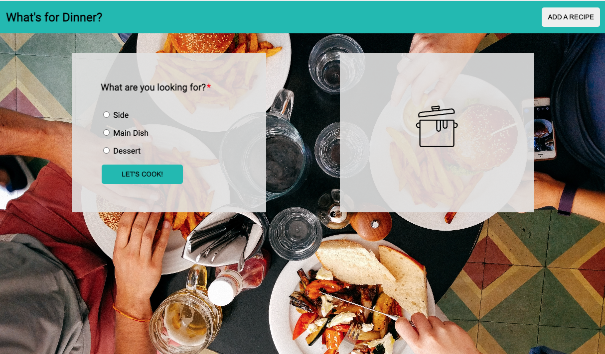
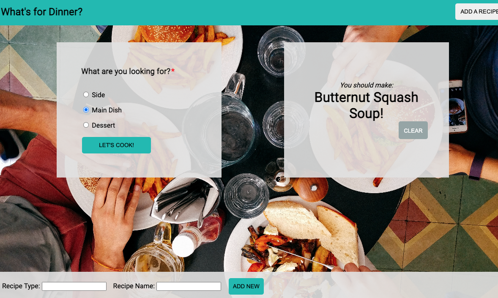

# **What's For Dinner?**

What's For Dinner is a feast of ideas for the uninspired, confused or otherwise indecisive home chef.

This project allows users to select what type of dish they need inspiration for and receive a suggestion at the click of a button. If they are so inspired that they think of their own addition, they can add a recipe that will be saved in the category notated or in a newly displayed "Other Dishes"

# **Contributors**

[Angele Williams](https://github.com/angelewilliams)

# **Technologies Used**

- JavaScript
- HTML
- CSS

# **Local Set up Instructions**

- From this repository, click the code button and copy the SSH link.
- Open terminal by pressing command + space bar, and search for terminal
- Inside of you terminal type "git clone" and then paste the ssh link should look like git clone [https://github.com/angelewilliams/whats-for-dinner](https://github.com/angelewilliams/whats-for-dinner)
- In your terminal type "cd whats-for-dinner"
- Then type "open index.html"
- The browser should then deploy.

# **Instructions For Use**
- On opening the browser, select a dish type and click _"LET'S COOK!"_ to view a random suggestion of what to make.
- When a user clicks on the _“ADD A RECIPE”_ button, they should see a form appear at the bottom of the screen and be able to add a recipe type and recipe name.
  
  Click the _“ADD NEW”_ button below to see your recipe idea displayed!

- A user may clear their selection by clicking _"CLEAR"_ which will reset the form and show the cookpot icon once again.
